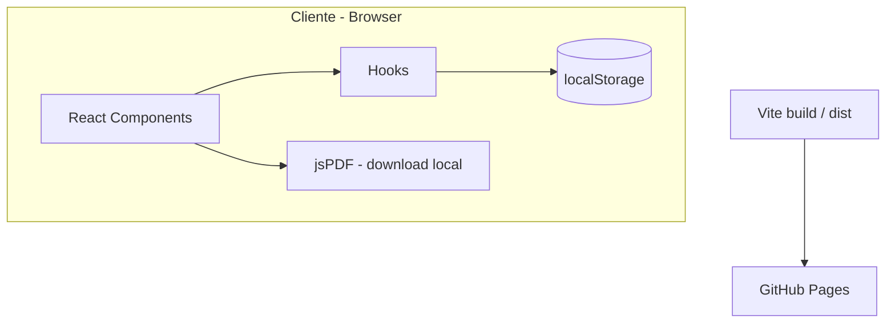
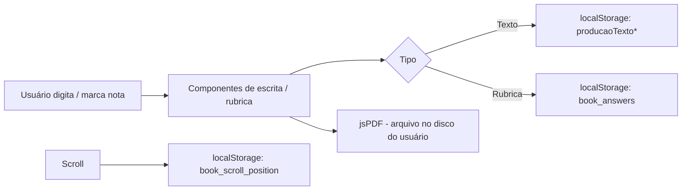

# SDD — Software Design Document

> **Projeto:** Rumo à Redação Nota 1000  
> **Foco:** estado **presente** (o que existe hoje)  
> **Última atualização:** 2026-07-15 (rubrica dissertativo-argumentativo)

---

## 1. Visão

- 📚 Livro digital interativo para a **3ª série · Volume 1**, centrado na produção de **texto dissertativo-argumentativo**.
- ✍️ O estudante lê o material, pratica em folhas pautadas (rascunho + final), exporta PDF e se autoavalia por rubrica.
- 🌐 Publicação estática no **GitHub Pages** — sem login e sem backend.

### Objetivos atuais

| Objetivo | Como está atendido hoje |
| --- | --- |
| Guiar a produção textual | Capítulo didático + proposta de produção em `Book.tsx` |
| Espaço de escrita | `RascunhoTexto`, `ProducaoTextoFinal` + `FolhaPautada` |
| Feedback formativo | `CriteriosAvaliacao` — rubrica 0/1/2 alinhada ao **dissertativo-argumentativo** |
| Continuação da sessão | Persistência em `localStorage` |
| Distribuição | Build Vite + `gh-pages` |

---

## 2. Escopo do produto (presente)

### Dentro do escopo

- ✅ Conteúdo didático em página única (SPA)
- ✅ Dois rascunhos + uma folha de redação final
- ✅ Download PDF local (`jspdf`)
- ✅ Rubrica de autoavaliação
- ✅ QR / link de tutorial (placeholder ainda ativo)
- ✅ Header, paginação visual, footer institucional

### Fora do escopo (hoje)

- ❌ Banco de dados / API / autenticação
- ❌ Sync entre dispositivos
- ❌ Painel do professor / correção remota
- ❌ Testes automatizados e CI

---

## 3. Arquitetura

### Stack

- **UI:** React 18 + TypeScript
- **Build:** Vite 5 (`base: './'`)
- **Estilo:** Tailwind CSS 3 + CSS de capítulo (`index.css`)
- **PDF:** `jspdf`
- **Deploy:** `gh-pages` → `https://naygracioliarco.github.io/redacao-nota-mil/`

### Diagrama de camadas

Ver Diagrama

### Fluxo de dados

Ver Diagrama

### Mapa de módulos

| Camada | Caminho | Papel |
| --- | --- | --- |
| Entrada | `src/main.tsx` → `App.tsx` | Monta `<Book />` |
| Orquestração | `src/components/Book.tsx` | Conteúdo + seções interativas |
| Escrita | `FolhaPautada`, `RascunhoTexto`, `ProducaoTextoFinal` | Folha pautada + PDF |
| Avaliar | `CriteriosAvaliacao`, `ChecklistAutoavaliacao`, `GabaritoOnlineBanner`, `GradeCorrecao` | Rubrica, checklist e faixa de gabarito |
| Glossário | `TermoGlossario` | Termo clicável + popover de significado |
| Shell | `Header`, `Footer`, `Pagination`, `Chapter` | Identidade e paginação visual |
| Estado | `hooks/useUserAnswers`, `usePagination`, `useScrollPosition` | Sessão no cliente |
| Persistência | `utils/storage.ts` | Read/write `book_answers` |
| Assets | `lib/publicUrl.ts` + `public/images/` | URLs com `BASE_URL` |

---

## 4. Persistência (substitui “banco”)

Não há SGBD. O “modelo de dados” atual é:

Ver Tabela — Keys localStorage

| Key | Dono | Formato |
| --- | --- | --- |
| `book_answers` | `storage.ts` / `useUserAnswers` | `{ [id: string]: string \| number \| boolean }` |
| `producaoTexto1` | `RascunhoTexto` | `string` |
| `producaoTexto2` | `RascunhoTexto` | `string` |
| `producaoTextoFinal` | `ProducaoTextoFinal` | `string` |
| `book_scroll_position` | `useScrollPosition` | número serializado |

- 🔑 Rubrica: chaves compostas `${instanceId}_${criterio.id}` (ex.: `producao_final_adequacao_genero`).
- 🧹 `clearAnswers()` existe em `storage.ts`, mas **ainda sem UI**.

---

## 5. Deploy

1. `npm run build` → pasta `dist/`
2. `npm run deploy` → branch `gh-pages`
3. Assets relativos (`base: './'`) para funcionar em `/redacao-nota-mil/`

---

## 6. Restrições e riscos conhecidos (presente)

- ⚠️ `Book.tsx` monolítico (~600 linhas) concentra conteúdo e UI.
- ⚠️ Há possível divergência de **limites de linhas** entre proposta de produção, folha final e rubrica (próximo item do Roadmap).
- ⚠️ Fontes locais (`HWT-Artz`) referenciadas, pasta `public/fonts` ausente.
- ⚠️ `usePagination` observa o `body` via `MutationObserver` (custo de scroll).
- ⚠️ Tutorial/QR usa URL placeholder.

### Rubrica e checklist (estado atual)

- 5 critérios em `Book.tsx` → `CriteriosAvaliacao` (`instanceId: producao_final`)
- Gênero: dissertativo-argumentativo (tese, argumentação, conclusão)
- Extensão referida na rubrica: **15–20 linhas** (ainda a unificar com a proposta)
- `ChecklistAutoavaliacao`: componente reutilizável; itens via props; checks em `book_answers` com chave `${instanceId}_${item.id}` (boolean)
- `GabaritoOnlineBanner`: faixa roxa com QR + título/itens via props (`prefix` + `text`); QR clicável opcional (`href`)
- `TermoGlossario`: termo clicável com popover; props `termo` + `significado` (reutilizável)

---

## 7. Governança de documentação

Este repositório segue o fluxo **D.N.E.E.** (`.cursorrules`):

1. **Descobrir** no chat  
2. **Nortear / Especificar** via este SDD + `ROADMAP.md`  
3. **Evidenciar** em `CHANGELOG_EVIDENCES.md`  
4. **Visualizar** em `docs/visao-projeto.html`
